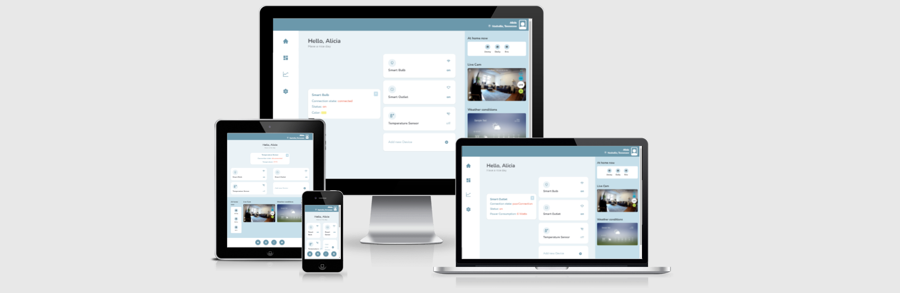

# Smart Home Dashboard solution

See the live version of [Smart Home Dashboard](https://smart-home-dashboard.vercel.app/). The client is deployed to [Vercel](https://vercel.com/), test server lives on [Heroku](https://id.heroku.com).

The project is a sample of a smart home web app interface. It comprises of a mockup UI and an interactive part being a list of three smart devices with information about their state.

**Main features**:

- user can see the updated state of each device: on/off, device type (icon), device name and connection quality (icon)
- after clicking a device card, a new dialog window opens with details of a given device
- user can drag the window around the main part of the screen

&nbsp;

## 💡 Technologies


&nbsp;

## 💿 Installation

### Frontend

The project uses [node ver16.14.0](https://nodejs.org/en/) and [npm ver8.3.1](https://www.npmjs.com/).

1. `git clone` https://github.com/pawelpikus/smart-home-dashboard.git
2. `cd` into project root directory
3. `npm i`

Then, you can run:

#### `npm start`

Runs the app in the development mode.\
Open [http://localhost:3000](http://localhost:3000) to view it in the browser.

The page will reload if you make edits.\
You will also see any lint errors in the console.

#### `npm test`

Launches the test runner in the interactive watch mode.\

#### `npm run build`

Builds the app for production to the `build` folder.\
It correctly bundles React in production mode and optimizes the build for the best performance.

&nbsp;

### Backend

In order to fetch data into the web app, you need to start a test server. The test server is built using [node ver16.14.0](https://nodejs.org/en/).

1. `git clone` https://github.com/pawelpikus/smart-home-dashboard-api.git
2. `cd` into project root directory
3. `npm i`

Then, you can run:

#### `npm start`

Runs the server in the development mode.\
Open [http://localhost:4001](http://localhost:4001) to view the status in the browser.

## 🤔 Solutions provided in the project

### Frontend

- I used [interact.js](https://interactjs.io/) library to enable dragging the main dialog window. In order to use its features in a React app, I utilised `useRef` and `useLayoutEffect` hooks.

```js
useLayoutEffect(() => {
  if (draggableRef.current) {
    const interactable = interact(draggableRef.current);
    interactable.draggable({
      inertia: true,
      modifiers: [
        interact.modifiers.restrictRect({
          restriction: "parent",
          endOnly: true,
        }),
      ],
      listeners: {
        move(event) {
          position.x += event.dx;
          position.y += event.dy;
          event.target.style.webkitTransform = event.target.style.transform =
            "translate(" + position.x + "px, " + position.y + "px)";
        },
      },
    });
  }
});
```

&nbsp;

- Compound Components Design Pattern - in order to avoid props drilling and have more flexibility over the building blocks of the app

```js
<Main>
  <Main.Container>
    <Main.Title>Hello, Alicia</Main.Title>
    <Main.Subtitle>Have a nice day</Main.Subtitle>
    <Main.DFlex>
      <Main.Dialog
        response={response}
        setShow={setShow}
        show={show}
        type={type}
      />
      <Main.Devices
        response={response}
        error={error}
        setShow={setShow}
        setType={setType}
      />
    </Main.DFlex>
  </Main.Container>
</Main>
```

&nbsp;

- a pretty useful workaround for the case when Typescript throws an error if you try to use property accessor as index using bracket notation:

```js

// `PropertyKey` is short for "string | number | symbol"
  // since an object key can be any of those types, our key can too
  // in TS 3.0+, putting just "string" raises an error
  function hasKey<O>(obj: O, key: PropertyKey): key is keyof O {
    return key in obj;
  }

<Card
    key={response[device].id}
    type={response[device].type}
    setType={setType}
    setShow={setShow}
    >
```

&nbsp;

- a nice way to tree-shake your imports: create an `index.ts` file in the directory containing the components, and export all of them, e.g.:

```js
export { default as Header } from "./header";
export { default as AppLayout } from "./AppLayout";
export { default as Avatar } from "./avatar";
export { default as Main } from "./main";
export { default as SideBar } from "./sidebar";
```

That enables you to import all the components under one named import, like so:

```js
import { Header, AppLayout, Avatar, Main, Sidebar } from "./components";
```

&nbsp;

### Backend

- used [socket.io](https://socket.io/) to establish a websocket-like connection with the client, which enabled bidirectional and low-latency communication

```js
const { Server } = require("socket.io");

const httpServer = createServer(app);
const io = new Server(httpServer, {
  cors: {
    origin: [
      "http://localhost:3000",
      "https://smart-home-dashboard.vercel.app",
    ],
  },
});

io.on("connection", (socket) => {
  console.log(`New client connected,${socket.id} `);

  setTimeout(() => getApiAndEmit(socket), 3000);
  socket.on("disconnect", () => {
    console.log(`Client disconnected, ${socket.id}`);
  });
});
const getApiAndEmit = (socket) => {
  socket.emit("refresh", smartDeviceDetails);
};
httpServer.listen(port, () => console.log(`Listening on port ${port}`));
```

- utilised a naive (but working:) way to update data on the server using `setInterval`. Then, the `io.emit` event sends new data every 3000ms.

```js
interval = setInterval(() => getApiAndEmit(socket), 2000);
...
const getApiAndEmit = (socket) => {
  getDeviceDetails();

  socket.emit("refresh", getDeviceDetails());
```

## 💭 Conclusions

There are better ways to handle the server logic, for sure. I need to work on that in the future...
Also, I failed to meet the requirement to open the main dialog window in the same position it was closed before. Need to figure it out using `useState` and `useEffect` probably... It was fun with interact.js but still I need to dive deeper into utilising its functions in a more meaningful way.

## 🙋‍♂️ Feel free to contact me

LinkedIn - [/in/pawel-pikus](https://www.linkedin.com/in/pawel-pikus/)

&nbsp;

## 👏 Thanks / Special thanks / Credits

Thanks to [dribbble.com](https://dribbble.com/) for inspiration on UI design.
Thanks to [devmentor.pl](https://devmentor.pl/) - for a cool Readme.md template.
